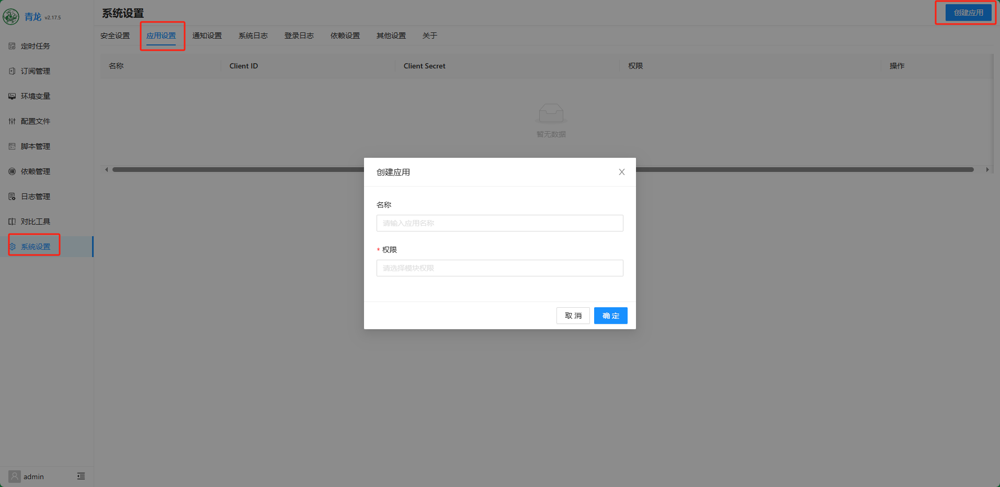
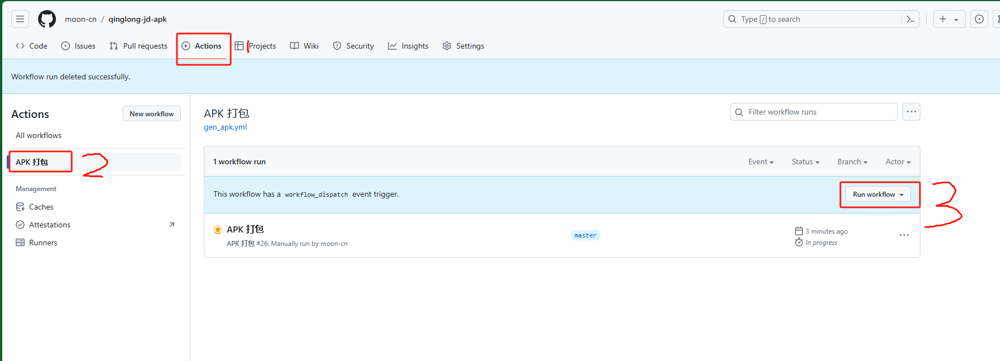
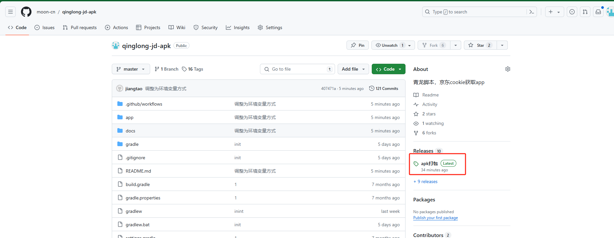

# 介绍
青龙脚本，京东cookie获取上传APP
- 手机使用app
- 登录后，自动将cookie上传到青龙脚本服务器
- 源码全部开放


## 界面


# 使用方式一、利用Github Action自动打包apk (已测试成功)
- fork 本项目 
- 在青龙后台创建一个应用，赋予修改变量的权限。 依次点击【系统设置】【应用设置】【创建应用】 ，名称无所谓，权限选择 环境变量。 创建后得到Client ID，Client Secret
  

- 点击Actions菜单，点击左侧 【APK打包】，点击右侧【Run workflow】手动触发打包流程，等待构建流程完毕，约4分钟 。 
   
- 回到项目首页，在右侧Releases菜单下查看最新apk。 下载apk后，建议删除打包结果，每次需要的时候再打包。
   

# 使用方式二、自行编译
1. 克隆 本项目
2. 直接打包即可，无需修改代码 app/src/main/java/cn/moon/ql/Config.java 中的青龙配置。

# 更新日志
- 20240613 github action打包apk支持 Secret方式。 

# 开发笔记, 记录开发过程中遇到的问题
接口参考文档：https://qinglong.ukenn.top

## 使用actions打包遇到问题
 由于使用github密码方式，自然想到使用linux 命令 sed 替换密码，没考虑到 url 中含有斜杠， 如http://xxx.com。这个斜杠和sed命令中的斜杠冲突了。修改为#即可。
 主要还是因为对linux 的sed命令不熟悉

## 签名相关
jks 在docs目录下
密码： 123123
alias(别名): key0 

## github actions
需要生成base64时， 使用 gitbash 打开jks文件所在目录（docs）， 执行
```
openssl base64 < qinglong-client.jks | tr -d '\n' | tee some_signing_key.jks.base64.txt
```


